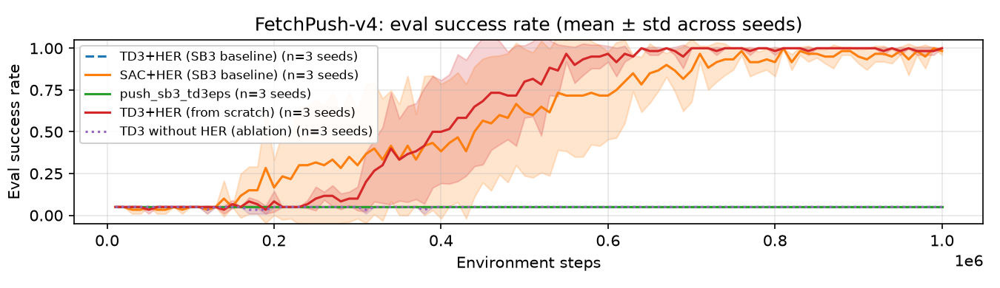

# From-Scratch TD3 + HER on Fetch Manipulation

LaunchPad 2026 submission — Griffin Labs "RL From Scratch" track.

A TD3 agent with Hindsight Experience Replay, written from first
principles in PyTorch (`src/agent/` — training loop, algorithm, and
networks; no RL-library code), trained on sparse-reward Fetch
manipulation and measured against the Stable-Baselines3 TD3+HER
baseline under an identical evaluation protocol.

## Judge quickstart (< 15 min)

Requires [uv](https://docs.astral.sh/uv/) (any platform; CPU is enough).

```bash
git clone https://github.com/eugenewong22/RL-Launchpad.git && cd RL-Launchpad
uv sync                                    # installs pinned deps from uv.lock
uv run python scripts/check_env.py         # simulator sanity check
uv run pytest                              # unit + integration tests

# Evaluate the reported checkpoint on the R4 protocol (50 fixed eval seeds):
uv run python -m src.agent.evaluate \
    --checkpoint results/push_td3_her_seed0/checkpoint_best.pt \
    --env-id FetchPush-v4 --episodes 50
```

Expected final line:

```
FetchPush-v4: success_rate=1.000 mean_return=-10.4 over 50 episodes (eval seeds 10000..10049)
```

**Measured end-to-end** (Apple M-series laptop, CPU only, rehearsed from a
clean clone into an empty directory):

| Stage | Cold cache | Warm cache |
|---|---|---|
| `git clone` (80 MB) | 14–36 s | 14–36 s |
| `uv sync` | 10 s (792 MB of wheels downloaded) | 1 s |
| `check_env.py` | 7 s | 7 s |
| `pytest` (40 tests) | 15 s | 15 s |
| 50-episode eval | 2 s | 2 s |
| **total** | **~50–70 s** | **~40–60 s** |

Both network-bound rows are reported as ranges because that is what we
measured: two clones of the same commit took 36 s and 14 s. The 792 MB is
dominated by the pinned PyTorch wheel, so a slow link moves `uv sync` and
nothing else — even at 1 MB/s the total stays well inside the 15-minute
budget. `check_env.py` is first-run MuJoCo initialisation in a fresh venv,
not a repo cost.

The repo is 80 MB because it carries a checkpoint for **every** reported
run — all three from-scratch seeds, all three no-HER seeds, and all six SB3
baseline arms. That is a deliberate trade: a judge can re-run any number in
this README rather than only the headline one.

To watch the policy, render episodes from the same checkpoint and seeds:

```bash
uv run python scripts/record_video.py \
    --checkpoint results/push_td3_her_seed0/checkpoint_best.pt \
    --env-id FetchPush-v4 --episodes 5 --out results/demo.mp4
```

## Demo video

**[`results/demo_final.mp4`](results/demo_final.mp4)** — 47 s. FetchPush
successes, a labelled failure case, and the PickAndPlace stretch task, all
rendered by `scripts/record_video.py` from the same checkpoints the numbers
below come from (R4). The closing results card reads its figures from
`results/final_eval_push.md`, so it cannot disagree with the table.

Rebuild it with `uv run python scripts/make_demo.py`. One caveat stated on
the clip itself: the failure episode comes from held-out seeds 2000+, not
the reported 50 — those contain no seed-0 failure, so finding one required
looking outside them.

## Results

FetchPush-v4, 50 episodes × 3 seeds on eval seeds 10000–10049, disjoint
from training (`results/final_eval_push.md`):

| Arm | Success (mean ± std) | Per-seed |
|---|---|---|
| **TD3+HER — from scratch** | **0.993 ± 0.009** | 1.00, 1.00, 0.98 |
| SAC+HER — SB3 baseline | 0.993 ± 0.009 | 1.00, 0.98, 1.00 |
| TD3+HER — SB3 baseline | 0.040 ± 0.000 | 0.04, 0.04, 0.04 |
| TD3 no-HER — our ablation | 0.040 ± 0.000 | 0.04, 0.04, 0.04 |
| Scripted classical controller | 0.54 | deterministic |



We **match** SB3's SAC+HER — the tie is exact on both mean and std, and the
per-seed vectors differ only in which seed drops one episode. We do not
claim to beat it. Both figures regenerate from the committed CSVs with
`uv run python scripts/make_plots.py`.

The SB3 **TD3**+HER arm did not learn in 1M steps at its published
settings. Our own TD3+HER was equally flat at those settings until we
changed five things (`results/config_diff.md`), so we report that arm as a
**failed baseline configuration**, not as a 20× win — see `docs/writeup.md`
§3. FetchPickAndPlace, same config with zero re-tuning: **0.740 ± 0.082** (3 seeds: 0.74/0.84/0.64).
Robustness: **599/600** held-out non-eval initial states across the three
seeds (`results/failure_sweep.md`), and — with no domain randomization in
training — unchanged under 4× friction or an 8× heavier block, though a
light block degrades it (`results/dynamics_sweep.md`).

## Rules mapping

| Rule | Where |
|---|---|
| R1 from-scratch algorithm/networks | `src/agent/` only; `src/baseline/` is SB3 and clearly separated |
| R2 published baseline, same protocol | `src/baseline/train_sb3.py`, evaluated through the same `src/agent/evaluate.evaluate`. **Two SB3 baselines**: SAC+HER (matches us — the operative comparison) and TD3+HER (did not learn in 1M steps at SB3's published settings). We report the TD3 arm as a failed baseline configuration, not as a win; see `docs/writeup.md` §3. A third, **modified** arm (`src/baseline/td3_eps_random.py`) adds our ε-random exploration to SB3's TD3 to test whether that one mechanism explains its failure — it does not (`results/sb3_eps_experiment.md`). Kept out of the R4 table above precisely because it is modified |
| R3 reproducibility | `uv.lock` pins exact versions; configs, seeds **and every reported checkpoint** committed; this quickstart. The full FetchPush table below was re-derived on a laptop from the committed checkpoints and matched the cluster's output exactly, arm for arm |
| R4 standardized eval | **3 seeds × 50 episodes** on both FetchPush and FetchPickAndPlace, eval seeds `10000+i`, disjoint from training seeds. Scored on `checkpoint_best`; verified against a disjoint seed block (20000+) to rule out selection leakage — same 0.740. Demo clips render from the reported checkpoints on those seeds — except the labelled failure clip, drawn from a disjoint held-out block (2000+) because the reported 50 contain no seed-0 failure; stated on the clip and in `docs/writeup.md` §5 |
| R5 simulation only, stock tasks | Unmodified `FetchReach-v4` / `FetchPush-v4` / `FetchPickAndPlace-v4` — no reward, observation, action-space, or terrain changes |
| R6 compute honesty | every run logs env steps + wall-clock to `progress.csv`; `results/compute_table.md` aggregates |

## Reproduce the experiments

```bash
# Smoke test (2 min CPU): from-scratch TD3+HER on FetchReach -> ~100% success
uv run python -m src.agent.train --config configs/td3_her_reach.yaml --seed 0

# Full matrix: 3 seeds x {from-scratch TD3+HER, no-HER ablation, SB3 baseline} on FetchPush
bash scripts/run_all_seeds.sh

# Figures + compute table from committed CSVs
uv run python scripts/make_plots.py
```

## Layout

```
src/agent/          from-scratch code (R1): networks, HER buffer, TD3, train loop, eval
src/baseline/       SB3 TD3+HER / SAC+HER baseline runner (R2)
configs/            one YAML per experiment arm
scripts/            env check, run matrix, plots, video, failure sweep
tests/              unit + integration tests (written first; see git history)
docs/               writeup.md (the 4-page submission) + walkthrough.md
results/            committed progress.csv per run + checkpoints + figures
results/archive_broken_config/   the first campaign, which flat-lined on
                    every arm — kept, not deleted, so the negative result in
                    docs/writeup.md §5 is checkable
```

Every figure and table regenerates from the committed CSVs and configs:

```bash
uv run python scripts/make_plots.py            # learning curves + compute table
uv run python scripts/make_negative_figure.py  # the failed campaign + its config diff
uv run python scripts/failure_sweep.py         # failure modes on held-out states
```

The 4-page write-up is [`docs/writeup.md`](docs/writeup.md). To render the
print/PDF version (`docs/writeup.html`, self-contained, figures inlined):

```bash
uv run --with markdown python scripts/build_writeup.py
```

`--with` rather than a pinned dependency on purpose — a doc-build package
has no business in the lock file a judge installs from.
