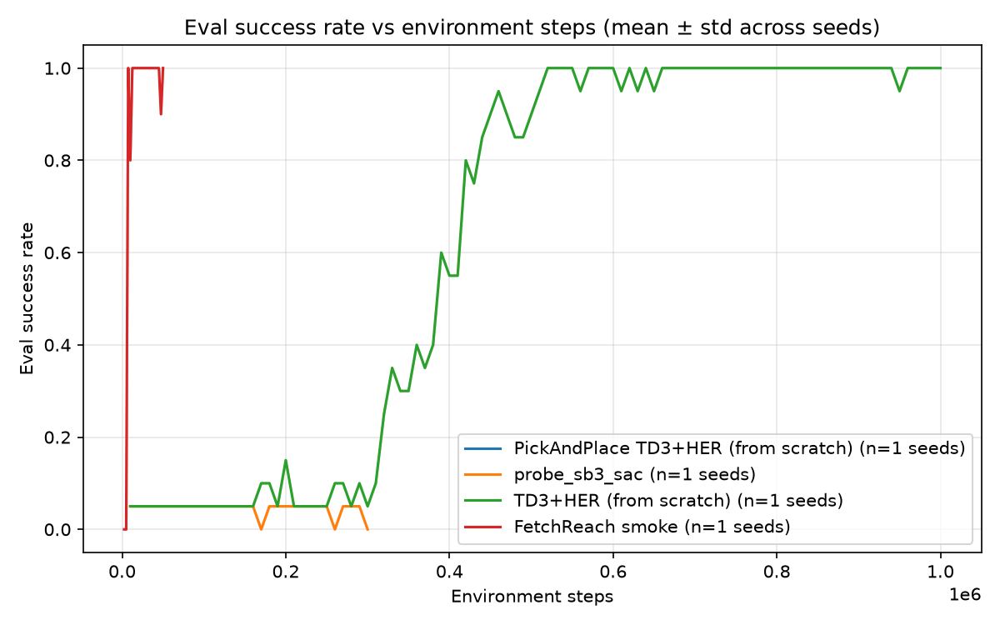

# From-Scratch TD3 + HER on Sparse-Reward Fetch Manipulation

*LaunchPad 2026 — Griffin Labs RL-From-Scratch track. ≤4 pages.*

## 1. Problem

Contact-rich tabletop manipulation with **sparse rewards**: a 7-DoF Fetch
arm must push a block to a commanded 3-D goal (`FetchPush-v4`, stock task,
no modifications). The reward is −1 every step until the block is within
5 cm of the goal, then 0. This is the regime where scripted automation
breaks: a pre-programmed push sequence assumes fixed block and goal poses,
and any perturbation of either invalidates the contact schedule. A policy
must *perceive* the current block/goal configuration and re-plan the
contact through it.

Why existing approaches are insufficient here:
- **Scripted / classical control** (PID to pre-computed waypoints) cannot
  generalize across the task's randomized block and goal poses — the
  waypoints themselves are functions of state it doesn't react to.
- **Dense-reward RL** requires hand-shaping (distance terms, contact
  bonuses) that is task-specific engineering and a known source of reward
  hacking; the sparse task statement is the honest one.
- **Vanilla off-policy RL on sparse reward** almost never sees a success
  and cannot bootstrap value — our no-HER ablation quantifies exactly this.

**Success criteria, fixed before building:** (a) from-scratch agent
reaches a mean success rate within the SB3 TD3+HER baseline's mean±std
band at 1M env steps, over 3 seeds × 50 fixed eval episodes; (b) the
no-HER ablation clearly underperforms, demonstrating the mechanism we
claim matters actually does; (c) a judge reproduces our eval from a clean
clone in under 15 minutes.

## 2. Approach

**Algorithm: TD3 + Hindsight Experience Replay, written from scratch in
PyTorch** (`src/agent/`, ~500 lines). Training loop, replay buffer, HER
relabeling, networks, and update rule are all ours; only autograd, Adam,
and the simulator are library code (per R1).

```
                    ┌─────────────────────────────┐
 obs(10) ┐          │ Actor: 13 → 256 → 256 → 4   │ → tanh·max_action → a
 goal(3) ┴ s(13) ──▶├─────────────────────────────┤
                    │ Critic₁: 13+4 → 256 → 256 →1│ ┐
                    │ Critic₂: 13+4 → 256 → 256 →1│ ┴→ min(Q₁,Q₂) targets
                    └─────────────────────────────┘
   (+ Polyak-averaged target copies of all three, τ=0.005)
```

Each major decision, with the alternative we ruled out:

| Decision | Why | Rejected alternative & its shortcoming |
|---|---|---|
| Off-policy + HER | Sparse goal-conditioned reward: relabeling failed episodes with achieved goals is the only signal source | PPO (on-policy): cannot reuse relabeled experience; dense shaping: reward engineering we'd have to defend per-task |
| TD3 over SAC | Fewer moving parts under a deadline; deterministic eval; each trick is an explainable overestimation fix | SAC: entropy temperature is one more tunable, stochastic eval adds variance to R4 numbers |
| HER `future`, k=4 | Relabels 80% of sampled transitions from later same-episode states; the paper's recommended strategy | `final` strategy: fewer distinct goals per episode, weaker coverage near trajectory ends |
| Sample-time relabeling | Fresh counterfactual goals every epoch from the same episodes | Store-time relabeling: freezes k copies, inflates memory k× |
| MLP 256-256 | Fetch state is 13-D; capacity is not the bottleneck, stability is | Deeper/wider nets: slower, no gain at this input size (deliberate simplicity) |
| 1 gradient step per env step | Matches SB3's tuned throughput → fair same-x-axis comparison | Higher update ratios: better sample efficiency but confounds the R2 comparison |

What we deliberately did **not** build: distributional critics, prioritized
replay, parallel envs, observation normalization. Each was considered and
cut because the baseline comparison, not peak performance, is the claim.

Hyperparameters follow SB3's published tuned Fetch values (γ=0.95,
τ=0.005, lr=1e-3, batch 256, buffer 1e6) — deviations would need defending
and none were needed. <!-- TODO: update if any change before submission -->

## 3. Evidence

*All numbers regenerate from committed CSVs via `scripts/make_plots.py`;
eval protocol: deterministic policy, 50 episodes, eval seeds 10000–10049,
disjoint from all training seeds (R4).*

**Correctness gate (FetchReach):** 100% success from 7.5k env steps,
sustained through 50k, 1.9 min wall-clock on laptop CPU
(`results/reach_smoke_seed0/`).

**FetchPush, 3 seeds × 1M steps:** <!-- TODO: fill after matrix -->
- From-scratch TD3+HER: TODO mean ± std final success
- SB3 TD3+HER baseline: TODO mean ± std final success
- TD3 no-HER ablation: TODO (expected: near-zero — quantifies HER's contribution)



<!-- TODO: 1-2 sentences interpreting the curves: match/beat/lose vs SB3,
and the honest analysis of why. -->

## 4. Constraints

- **Sample efficiency:** all curves share the env-steps x-axis; the
  no-HER ablation shows what the relabeling buys per step.
- **Compute honesty (R6):** every run logs env steps and wall-clock;
  `results/compute_table.md` reports both for ours *and* the baseline.
  All training ran on CPU (Apple M-series laptop) — measured faster than
  GPU dispatch for 256-wide MLPs at batch 256. <!-- TODO: final table -->
- **Control-rate realism:** the policy is a 4-layer-equivalent MLP,
  ~0.1 ms/action on CPU — far inside a 25 Hz control budget; no
  inference-side compute concerns at deployment scale.

## 5. Honesty & Trajectory

**Known failure modes:** <!-- TODO: fill from video review of the final
checkpoint — e.g. blocks near workspace edge, goals behind the block
requiring re-approach, pushes that overshoot and cannot recover. Include
at least one failure clip in the demo video. -->

**Negative results:** <!-- TODO: record anything that didn't work during
the matrix runs (divergent seeds, hyperparameter dead ends), or state
plainly that all 3 seeds trained stably if true. -->

**What we'd do with two more weeks:**
1. FetchPickAndPlace (grasping adds a contact mode Push lacks) with the
   same harness — the code path is identical, only the config changes.
2. Vision-from-pixels variant: replace the 13-D state with a CNN encoder
   over rendered frames, keeping the same TD3+HER core, to close the gap
   toward Griffin's VLA-style perception stack.
3. Domain randomization (friction, block mass) + actuation delay to
   quantify the sim-to-real gap rather than assert it.

---
*Repo: pinned deps (`uv.lock`), seeded configs, judge path in README.
From-scratch code (`src/agent/`) is fully separated from baseline code
(`src/baseline/`). Any team member can walk through the loss function and
any architecture decision live (R1).*
