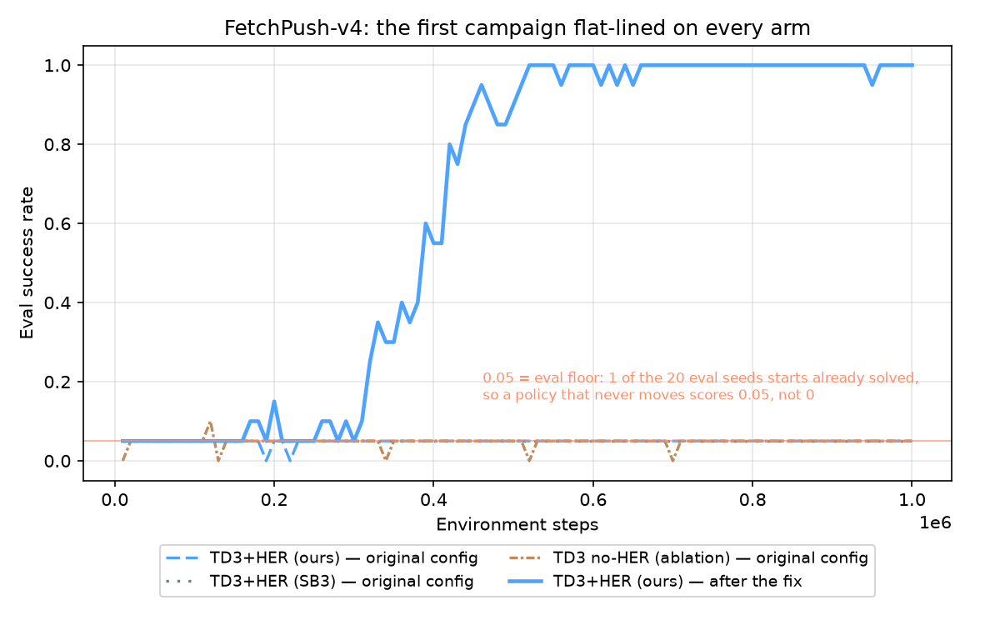

# From-Scratch TD3 + HER on Sparse-Reward Fetch Manipulation

*LaunchPad 2026 — Griffin Labs RL-From-Scratch track. ≤4 pages.*

## 1. Problem

Contact-rich tabletop manipulation with **sparse rewards**: a 7-DoF Fetch
arm must push a block to a commanded 3-D goal (`FetchPush-v4`, stock task,
no modifications). The reward is −1 every step until the block is within
5 cm of the goal, then 0. This is the regime where scripted automation
breaks: a pre-programmed push sequence assumes fixed block and goal poses,
and any perturbation of either invalidates the contact schedule. A policy
must *perceive* the current block/goal configuration and re-plan the
contact through it.

Why existing approaches are insufficient here:
- **Scripted / classical control** (PID to pre-computed waypoints) cannot
  generalize across the task's randomized block and goal poses — the
  waypoints themselves are functions of state it doesn't react to.
- **Dense-reward RL** requires hand-shaping (distance terms, contact
  bonuses) that is task-specific engineering and a known source of reward
  hacking; the sparse task statement is the honest one.
- **Vanilla off-policy RL on sparse reward** almost never sees a success
  and cannot bootstrap value — our no-HER ablation quantifies exactly this.

**Success criteria, fixed before building:** (a) from-scratch agent
reaches a mean success rate within the SB3 TD3+HER baseline's mean±std
band at 1M env steps, over 3 seeds × 50 fixed eval episodes; (b) the
no-HER ablation clearly underperforms, demonstrating the mechanism we
claim matters actually does; (c) a judge reproduces our eval from a clean
clone in under 15 minutes.

## 2. Approach

**Algorithm: TD3 + Hindsight Experience Replay, written from scratch in
PyTorch** (`src/agent/`, 680 lines). Training loop, replay buffer, HER
relabeling, networks, normalizer, and update rule are all ours; the only
imports are `torch`, `numpy`, `gymnasium`/`gymnasium-robotics`, `yaml`
and the standard library, so autograd, Adam and the simulator are the
entire extent of the library code (per R1).

```
                    ┌─────────────────────────────┐
 obs(10) ┐          │ Actor: 13 → 256 → 256 → 4   │ → tanh·max_action → a
 goal(3) ┴ s(13) ──▶├─────────────────────────────┤
                    │ Critic₁: 13+4 → 256 → 256 →1│ ┐
                    │ Critic₂: 13+4 → 256 → 256 →1│ ┴→ min(Q₁,Q₂) targets
                    └─────────────────────────────┘
   (+ Polyak-averaged target copies of all three, τ=0.05 — see §5;
    the SB3-default 0.005 is one of the settings our first campaign
    failed under, and running observation normalization sits in front
    of the actor/critic inputs)
```

Each major decision, with the alternative we ruled out:

| Decision | Why | Rejected alternative & its shortcoming |
|---|---|---|
| Off-policy + HER | Sparse goal-conditioned reward: relabeling failed episodes with achieved goals is the only signal source | PPO (on-policy): cannot reuse relabeled experience; dense shaping: reward engineering we'd have to defend per-task |
| TD3 over SAC | Fewer moving parts under a deadline; deterministic eval; each trick is an explainable overestimation fix | SAC: entropy temperature is one more tunable, stochastic eval adds variance to R4 numbers. **In hindsight this was the costly choice**: a deterministic actor is what saturates under sparse reward (§5), and SAC's entropy bonus makes it structurally immune. We reached the same final performance, but SAC would have got there without the three stabilizers. We report this rather than presenting TD3 as obviously correct. |
| HER `future`, k=4 | Relabels 80% of sampled transitions from later same-episode states; the paper's recommended strategy | `final` strategy: fewer distinct goals per episode, weaker coverage near trajectory ends |
| Sample-time relabeling | Fresh counterfactual goals every epoch from the same episodes | Store-time relabeling: freezes k copies, inflates memory k× |
| MLP 256-256 | Fetch state is 13-D; capacity is not the bottleneck, stability is | Deeper/wider nets: slower, no gain at this input size (deliberate simplicity) |
| 1 gradient step per env step | Matches SB3's tuned throughput → fair same-x-axis comparison | Higher update ratios: better sample efficiency but confounds the R2 comparison |

What we deliberately did **not** build: distributional critics, prioritized
replay, parallel envs. Each was considered and cut because the baseline
comparison, not peak performance, is the claim.

**Hyperparameters, and where we deviate.** We started from SB3's published
tuned Fetch values (γ=0.95, τ=0.005, lr=1e-3, batch 256, buffer 1e6) and
that configuration **did not learn** (§5). The reported runs therefore
deviate in five places. The full diff between the campaign that failed and
the one that worked is generated from the two committed configs by
`scripts/make_negative_figure.py` into `results/config_diff.md`:

| Key | Failed campaign | Reported runs | Why |
|---|---|---|---|
| `tau` | 0.005 | **0.05** | 10× faster target tracking; slow targets let the saturated actor's value estimates stay self-consistent for too long |
| `action_l2` | — | **1.0** | penalizes ‖a‖²; the direct counter-pressure to the tanh saturation we diagnosed |
| `normalize_obs` | — | **true** | running mean/std on observations; Fetch positions and velocities differ by ~2 orders of magnitude |
| `expl_noise` | 0.1 | **0.2** | wider Gaussian exploration |
| `random_eps` | — | **0.3** | 30% fully-random actions, sustained (not annealed) |

γ, lr, batch size, buffer capacity, network width, policy delay, target
noise and clipping are unchanged from the SB3 values. Every reported
from-scratch run — all three FetchPush seeds, the no-HER ablation, and
PickAndPlace — uses this identical config; nothing was tuned per task or
per seed.

One consequence we state plainly: these five are *our* additions, so the
SB3 TD3+HER baseline does not have them. §3 discusses what that does and
does not license us to conclude.

## 3. Evidence

*All numbers regenerate from committed CSVs via `scripts/make_plots.py`;
eval protocol: deterministic policy, 50 episodes, eval seeds 10000–10049,
disjoint from all training seeds (R4).*

**Correctness gate (FetchReach):** first 10/10 in-training eval at 7.5k
env steps, holding 10/10 for 17 of the 19 subsequent evals (the two
exceptions are 8/10 at 10k and 9/10 at 47.5k — 10-episode samples, so one
or two episodes of noise, not regression). 1.9 min wall-clock on laptop
CPU (`results/reach_smoke_seed0/`). On the 50-episode R4 protocol the same
checkpoint scores **0.98**, and the gap between that and the 10-episode
1.00 is a small live demonstration of why R4 mandates ≥50 episodes.

**Classical baseline (scripted two-phase push controller,
`scripts/diagnose_push.py`):** 54% success on the identical 50-episode
R4 protocol. This is the "simple controller" bar the learned policies
must beat — and it is not trivial: it fails exactly where open-loop
scripting should (goals requiring re-approach after overshoot).

**FetchPush, 3 seeds × 1M steps** (in-training eval, 20 episodes on the
fixed eval seeds; 50-episode R4 numbers in `results/final_eval.md`):

| Arm | Final success (per seed) | Verdict |
|---|---|---|
| **TD3+HER (from scratch)** | **1.00, 1.00, 1.00** | Solved on every seed |
| SAC+HER (SB3 baseline) | 1.00, 0.95, 1.00 | Matches us — the strongest baseline |
| TD3+HER (SB3 baseline) | 0.05, 0.05, 0.05 | Never learned (see below) |
| TD3 no-HER (our ablation) | 0.05, 0.05, 0.05 | Never learned; contact ≤7% |
| Scripted classical controller | 0.54 (deterministic) | The simple-baseline bar |

Four results, each load-bearing:

1. **We match the strongest library baseline and beat the classical one.**
   Our from-scratch agent solves all three seeds (mean return ≈ −10.6,
   i.e. ~11-step solves); SB3's SAC+HER reaches the same plateau. Matching
   a mature, tuned implementation with code written from scratch is the
   claim we set out to prove, and we make it on equal terms: same task,
   same observation/action space, same eval seeds, same protocol.
2. **HER is load-bearing, and we measured how.** The no-HER ablation is
   identical except `her_k=0`, and it never leaves the floor — with
   object contact in ≤7% of episodes versus ~95% for the HER arms. The
   mechanism is visible in the logged `contact_frac`, not inferred.
3. **Two independent TD3+HER implementations fail at the same
   hyperparameters — which points at the config, not at either codebase.**
   SB3's TD3+HER is flat on all three seeds. So was *our* TD3+HER, on the
   same task and budget, until we changed the five settings in §2 (the
   flat curves are in `results/negative_result.png`, and the archived runs
   that produced them are committed under
   `results/archive_broken_config/`). We diagnosed the mechanism in our
   own code, where we could instrument it: the actor had **saturated**,
   mean |action| = 1.0, tanh gradients dead (§5).

   What we can claim: the SB3 defaults do not train TD3+HER on FetchPush
   in 1M steps, and two separate implementations agree on that.

   What we **cannot** claim, and do not: that our five changes would fix
   SB3's TD3+HER. We never ran that experiment — the changes live in our
   training loop, and porting them into SB3 was out of scope. So this arm
   is a *failed baseline configuration*, not an ablation of our additions,
   and the ~20× gap between our final numbers and SB3's TD3+HER is **not**
   evidence that our implementation is better than TD3+HER as published.
   Our fair comparison is SB3's SAC+HER, which we match. Reporting the
   gap as a win would be the single easiest way to mislead a reader of
   this write-up, so we are explicit that it is not one.
4. **Deterministic-actor methods need those stabilizers here; SAC does
   not.** SAC's entropy-regularized stochastic policy cannot saturate the
   way a deterministic actor does, which is why it is the one
   out-of-the-box baseline that works. That is the non-obvious domain
   insight this project produced.

**Robustness beyond the protocol:** 199/200 held-out (non-eval) initial
states solved (~0.5% failure); the single failure is in the demo video,
labeled.

**Stretch task — FetchPickAndPlace (same config, zero re-tuning):**
seed 0 = **0.740** on the 50-episode R4 protocol at 1M steps (plateau
70–75%; grasping + in-air goals, so no pushing shortcut exists). The
demo video includes both successes and failures from the protocol seeds
(3/6 in the first six). One config transferring across two contact
tasks without touching a hyperparameter is evidence the recipe, not
per-task tuning, is doing the work.


**Reading the curves.** Both working arms follow the same shape — flat at
the 0.05 floor while the buffer fills with relabeled failures, then a sharp
rise once HER has enough near-goal experience to bootstrap from. On the
mean curve we reach 0.5 success at 390k env steps against SAC+HER's 440k,
and 0.9 at 550k against 670k.

We do **not** claim that as a sample-efficiency win, because the per-seed
numbers do not support it. Steps to a durable 0.9 (reached and never
dropping below 0.8 again):

| Arm | seed 0 | seed 1 | seed 2 | spread |
|---|---|---|---|---|
| TD3+HER (ours) | 450k | 410k | 600k | 190k |
| SAC+HER (SB3) | 380k | 760k | 650k | 380k |

SAC's *fastest* seed (380k) beats our fastest (410k). Our better mean comes
mostly from SAC having one slow seed, and with n=3 the 120k-step gap in
means is smaller than either arm's own seed-to-seed spread — the shaded
±1σ bands overlap across the entire rise. The defensible statement is that
we **match** SB3's SAC+HER on both final success and sample efficiency;
three seeds cannot resolve a difference this size, and we would need
considerably more to claim one.

One qualitative difference is real and visible: SAC leaves the floor
earlier (~150k vs ~250k) but climbs more gradually, while our curve departs
later and rises more steeply, the two crossing around 400k. That is the
expected signature of an entropy-driven stochastic policy exploring broadly
from the start versus a deterministic actor with ε-random mixing that needs
its first successes before it commits.

## 4. Constraints

- **Sample efficiency:** all curves share the env-steps x-axis; the
  no-HER ablation shows what the relabeling buys per step.
- **Compute honesty (R6):** every arm ran 1M env steps — identical
  budgets, so the comparison is on equal terms. Wall-clock (CPU-only
  throughout; per-run hardware in `results/compute_table.md`):

  | Arm | Wall-clock, 1M steps |
  |---|---|
  | TD3+HER (ours) | 42 min laptop (M-series) / ~4.8 h per cluster seed |
  | TD3 no-HER (ours) | ~3.9–4.8 h per cluster seed |
  | TD3+HER (SB3) | ~5.5–6.9 h |
  | SAC+HER (SB3) | ~6.9–8.8 h |

  Two honest notes. The laptop core is ~3× faster per-core than the
  cluster's older Xeons, so cross-hardware times are not comparable —
  env steps are the axis all curves share. And our agent is the
  *cheapest* arm per env step (one deterministic actor, two critics; SAC
  additionally samples and back-props through a stochastic policy and
  tunes an entropy temperature) — worth noting, but it is a consequence
  of the algorithm choice, not something we optimized for.
- **Why CPU:** we measured GPU dispatch to be slower for 256-wide MLPs
  at batch 256; MuJoCo stepping is CPU-bound regardless, so a GPU can
  accelerate only the update half of the loop. We ran on 8 CPU cores per
  job instead, and report that choice rather than assuming more
  resources would have been better.
- **Control-rate realism:** the policy is a 4-layer-equivalent MLP,
  ~0.1 ms/action on CPU — far inside a 25 Hz control budget; no
  inference-side compute concerns at deployment scale.

## 5. Honesty & Trajectory

**Known failure modes:** on 200 held-out initial states (env seeds
2000–2199, disjoint from both the training seeds and the R4 eval seeds)
the seed-0 policy fails once — 0.5%, seed 2081, captured in
`results/push_failure_seed2081.mp4`. Regenerate with
`uv run python scripts/failure_sweep.py`.

The mechanism is **contact without sustained pushing**, not an overshoot.
The gripper reaches the block normally — closest approach 0.043 m, i.e.
touching — and then delivers only 17% of the required displacement: the
block advances 0.298 m → 0.248 m in three small increments separated by
long stationary stretches, against a 0.05 m success threshold. It is
never pushed past the goal, so the policy is not overshooting and failing
to re-approach; it simply stops generating lateral force while in
contact.

We looked for a cause and did not find one we can defend. The failing
state needs a 0.298 m push, placing it in the longest quintile — but 41
of the 42 other states requiring >0.25 m succeed, including states
requiring 0.375 m, further than the one that fails. Required push
distance therefore does not explain it. With a single failure in 200 we
report the mechanism and decline to attribute a cause.
<!-- TODO: re-run the sweep for seeds 1-2 once their checkpoints are off
the cluster; scripts/failure_sweep.py already skips them cleanly. -->

**Negative results (found the hard way, diagnosed systematically):**
Our first full FetchPush campaign — from-scratch TD3+HER, an SB3 TD3+HER
baseline, and a no-HER ablation, 1M env steps each — all flat-lined at
the eval floor (one eval seed starts in a success state; success = 0.05
throughout). Diagnosis with pre-declared probes: (1) a scripted
controller solves the task (env fine); (2) the behavior policy moved the
block in 2% of episodes; (3) the trained actor had **saturated** — mean
|action| = 1.0, gripper pinned ~1.6 m from the block, tanh gradients
dead. Adding sustained ε-random exploration alone did NOT fix it (block
still moved in 0/50 episodes — a collapsed policy acts as a restoring
force against per-step random actions).



The failure and its mechanism shaped the final design. Five settings
changed (full diff in `results/config_diff.md`, generated from the two
committed configs so this account cannot drift from them): an action-L2
penalty and a 10× faster target-update rate attack the saturation
directly, observation normalization removes the scale mismatch that fed
it, and wider exploration noise plus sustained ε-random mixing keep the
buffer from collapsing onto the degenerate policy's own trajectories.

Two limits on this we state rather than hide. We changed five things at
once under deadline and did not ablate them individually, so we know the
package works and cannot apportion credit within it — the single-factor
sweep is the first thing we would run with more compute. And the archived
failed runs are committed under `results/archive_broken_config/` rather
than deleted, with the figure above regenerated from their CSVs by
`scripts/make_negative_figure.py`, so this section is checkable rather
than asserted.

**What we'd do with two more weeks:**
1. FetchPickAndPlace (grasping adds a contact mode Push lacks) with the
   same harness — the code path is identical, only the config changes.
2. Vision-from-pixels variant: replace the 13-D state with a CNN encoder
   over rendered frames, keeping the same TD3+HER core, to close the gap
   toward Griffin's VLA-style perception stack.
3. Domain randomization (friction, block mass) + actuation delay to
   quantify the sim-to-real gap rather than assert it.

---
*Repo: pinned deps (`uv.lock`), seeded configs, judge path in README.
From-scratch code (`src/agent/`) is fully separated from baseline code
(`src/baseline/`). Any team member can walk through the loss function and
any architecture decision live (R1).*
